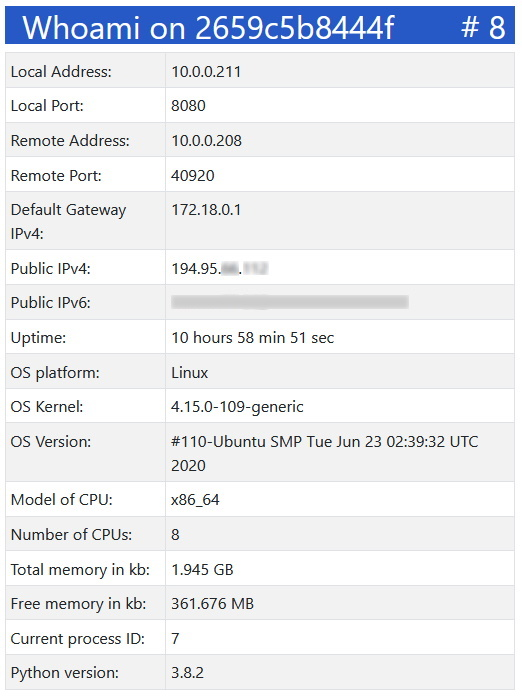

# whoami

A server that gives information about the container environment such as:

## Run whoami as a docker container

`docker run -p 8080:80 --name whoami -d jennerwein/whoami`

Running on your local computer access the container `whoami` by:  
IPv4: <http://127.0.0.1:8080>  or  
IPv6: <http://[::1]:8080>

## Remarks

* Run a red whoami container by:  
`docker run -p 8080:80 -e WHOAMICOLOR=red --name whoami -d jennerwein/whoami`
* Available values for `WHOAMICOLOR` are `red`, `blue`, `green`, `yellow`, `purpel`.
* Build and start a whoami container with the script:  
`./start-whoami.sh`
* Test and debug the *app* whoami in the directory `/app` with:  
 `python3 app.py`
* Test the *app* whoami with environment variables:  
`WHOAMICOLOR=red python app.py`
